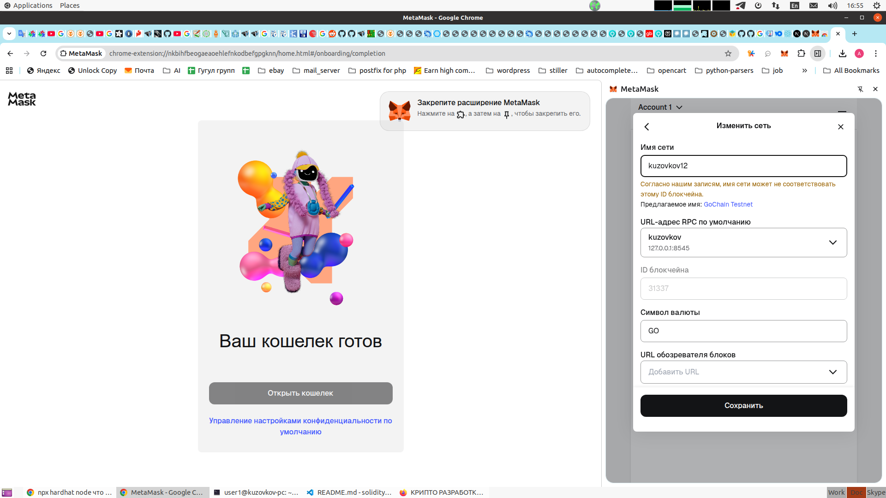
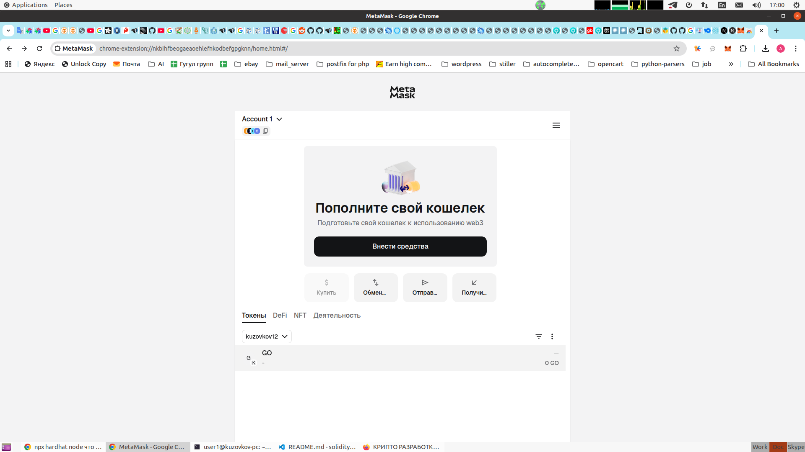
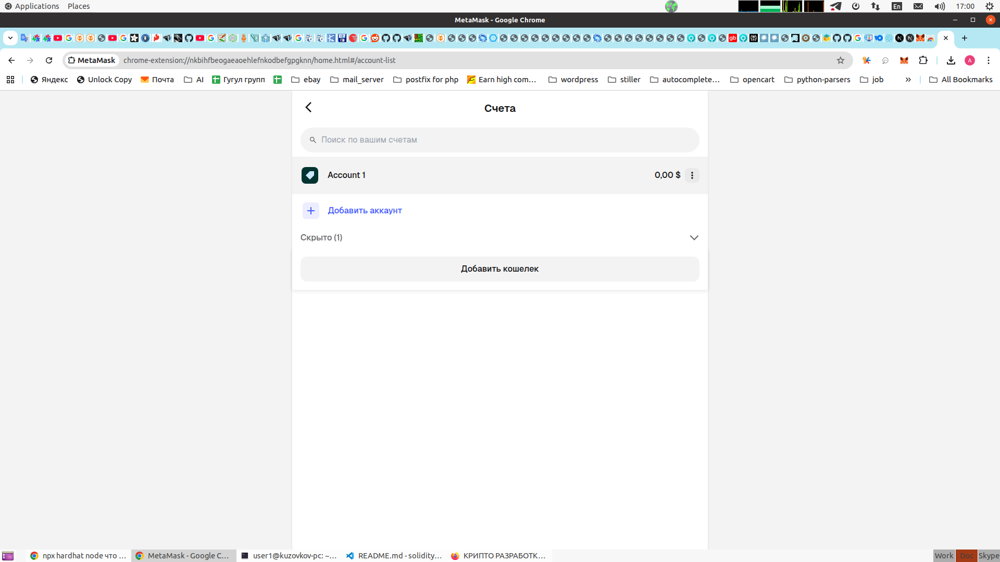
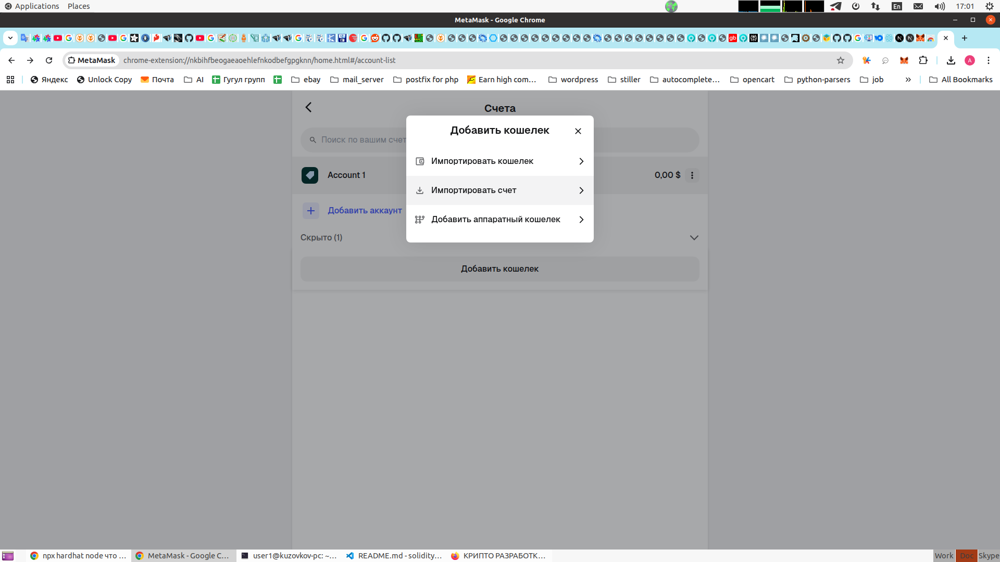
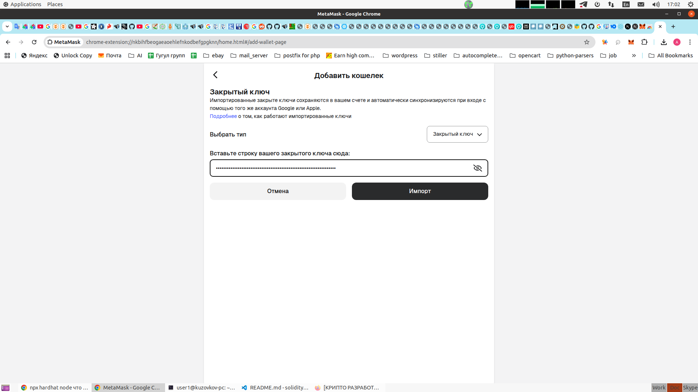
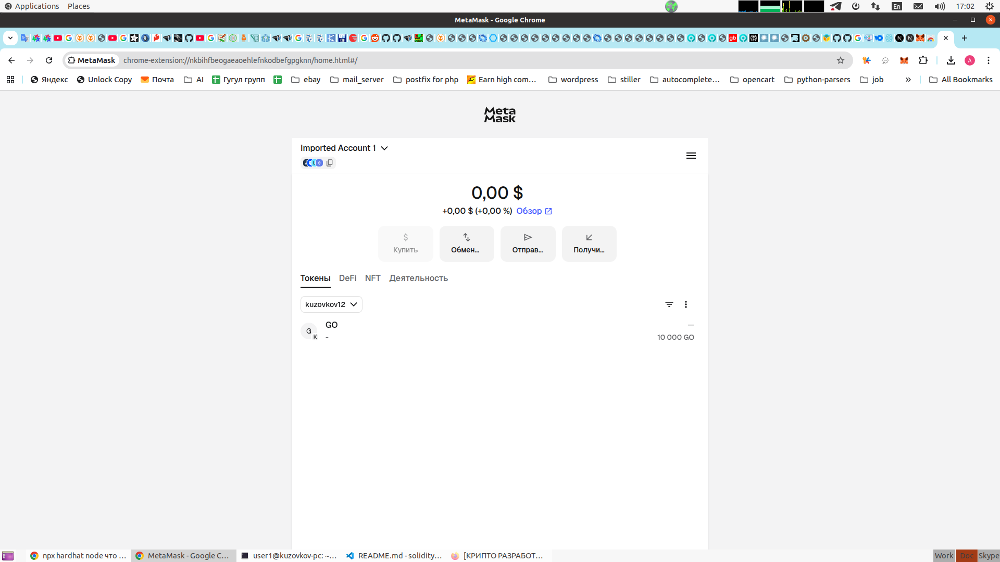

## Install hardhat

```bash
npm install --save-dev hardhat

npx hardhat --init

WARNING: You are using Node.js 20.19.0 which is not supported by Hardhat.
Please upgrade to 22.10.0 or a later LTS version (even major version number)


 █████  █████                         ███  ███                  ███      ██████
░░███  ░░███                         ░███ ░███                 ░███     ███░░███
 ░███   ░███   ██████  ████████   ███████ ░███████    ██████  ███████  ░░░  ░███
 ░██████████  ░░░░░███░░███░░███ ███░░███ ░███░░███  ░░░░░███░░░███░      ████░
 ░███░░░░███   ███████ ░███ ░░░ ░███ ░███ ░███ ░███   ███████  ░███      ░░░░███
 ░███   ░███  ███░░███ ░███     ░███ ░███ ░███ ░███  ███░░███  ░███ ███ ███ ░███
 █████  █████░░███████ █████    ░░███████ ████ █████░░███████  ░░█████ ░░██████
░░░░░  ░░░░░  ░░░░░░░ ░░░░░      ░░░░░░░ ░░░░ ░░░░░  ░░░░░░░    ░░░░░   ░░░░░░
 
👷 Welcome to Hardhat v3.4.0 👷

✔ Which version of Hardhat would you like to use? · hardhat-2
✔ Where would you like to initialize the project?

Please provide either a relative or an absolute path: · .
✔ What type of project would you like to initialize? · mocha-ethers-js
✔ The following files already exist in the workspace:
- README.md

Do you want to overwrite them? (y/N) · false
✨ Template files copied ✨
✔ You need to install the necessary dependencies using the following command:
npm install --save-dev "@nomicfoundation/hardhat-chai-matchers@^2.0.0" "@nomicfoundation/hardhat-ethers@^3.0.0" "@nomicfoundation/hardhat-ignition@^0.15.0" "@nomicfoundation/hardhat-ignition-ethers@^0.15.0" "@nomicfoundation/hardhat-network-helpers@^1.0.0" "@nomicfoundation/hardhat-toolbox@^6.0.0" "@nomicfoundation/hardhat-verify@^2.0.0" "@typechain/ethers-v6@^0.5.0" "@typechain/hardhat@^9.0.0" "chai@^4.2.0" "ethers@^6.4.0" "hardhat-gas-reporter@^2.3.0" "solidity-coverage@^0.8.0" "typechain@^8.3.0"

Do you want to run it now? (Y/n) · true

npm install --save-dev "@nomicfoundation/hardhat-chai-matchers@^2.0.0" "@nomicfoundation/hardhat-ethers@^3.0.0" "@nomicfoundation/hardhat-ignition@^0.15.0" "@nomicfoundation/hardhat-ignition-ethers@^0.15.0" "@nomicfoundation/hardhat-network-helpers@^1.0.0" "@nomicfoundation/hardhat-toolbox@^6.0.0" "@nomicfoundation/hardhat-verify@^2.0.0" "@typechain/ethers-v6@^0.5.0" "@typechain/hardhat@^9.0.0" "chai@^4.2.0" "ethers@^6.4.0" "hardhat-gas-reporter@^2.3.0" "solidity-coverage@^0.8.0" "typechain@^8.3.0"
npm error code ERESOLVE
npm error ERESOLVE unable to resolve dependency tree
npm error
npm error While resolving: soliditylearn@1.0.0
npm error Found: hardhat@3.4.0
npm error node_modules/hardhat
npm error   dev hardhat@"^3.4.0" from the root project
npm error
npm error Could not resolve dependency:
npm error peer hardhat@"^2.28.0" from @nomicfoundation/hardhat-ethers@3.1.3
npm error node_modules/@nomicfoundation/hardhat-ethers
npm error   dev @nomicfoundation/hardhat-ethers@"^3.0.0" from the root project
npm error   peer @nomicfoundation/hardhat-ethers@"^3.1.0" from @nomicfoundation/hardhat-chai-matchers@2.1.2
npm error   node_modules/@nomicfoundation/hardhat-chai-matchers
npm error     dev @nomicfoundation/hardhat-chai-matchers@"^2.0.0" from the root project
npm error
npm error Fix the upstream dependency conflict, or retry
npm error this command with --force or --legacy-peer-deps
npm error to accept an incorrect (and potentially broken) dependency resolution.
npm error
npm error
npm error For a full report see:
npm error /home/user1/.npm/_logs/2026-04-21T13_05_20_145Z-eresolve-report.txt
npm error A complete log of this run can be found in: /home/user1/.npm/_logs/2026-04-21T13_05_20_145Z-debug-0.log
An unexpected error occurred:

Error: Command "npm install --save-dev "@nomicfoundation/hardhat-chai-matchers@^2.0.0" "@nomicfoundation/hardhat-ethers@^3.0.0" "@nomicfoundation/hardhat-ignition@^0.15.0" "@nomicfoundation/hardhat-ignition-ethers@^0.15.0" "@nomicfoundation/hardhat-network-helpers@^1.0.0" "@nomicfoundation/hardhat-toolbox@^6.0.0" "@nomicfoundation/hardhat-verify@^2.0.0" "@typechain/ethers-v6@^0.5.0" "@typechain/hardhat@^9.0.0" "chai@^4.2.0" "ethers@^6.4.0" "hardhat-gas-reporter@^2.3.0" "solidity-coverage@^0.8.0" "typechain@^8.3.0" " exited with code 1
    at ChildProcess.<anonymous> (/home/user1/projects/soliditylearn/node_modules/hardhat/src/internal/cli/init/subprocess.ts:15:11)
    at ChildProcess.emit (node:events:524:28)
    at maybeClose (node:internal/child_process:1104:16)
    at ChildProcess._handle.onexit (node:internal/child_process:304:5)

If you think this is a bug in Hardhat, please report it here: https://hardhat.org/report-bug
user1@kuzovkov-pc:~/projects/soliditylearn$ npm install --save-dev --legacy-peer-deps "@nomicfoundation/hardhat-chai-matchers@^2.0.0" "@nomicfoundation/hardhat-ethers@^3.0.0" "@nomicfoundation/hardhat-ignition@^0.15.0" "@nomicfoundation/hardhat-ignition-ethers@^0.15.0" "@nomicfoundation/hardhat-network-helpers@^1.0.0" "@nomicfoundation/hardhat-toolbox@^6.0.0" "@nomicfoundation/hardhat-verify@^2.0.0" "@typechain/ethers-v6@^0.5.0" "@typechain/hardhat@^9.0.0" "chai@^4.2.0" "ethers@^6.4.0" "hardhat-gas-reporter@^2.3.0" "solidity-coverage@^0.8.0" "typechain@^8.3.0"
npm warn deprecated inflight@1.0.6: This module is not supported, and leaks memory. Do not use it. Check out lru-cache if you want a good and tested way to coalesce async requests by a key value, which is much more comprehensive and powerful.
npm warn deprecated glob@7.2.3: Old versions of glob are not supported, and contain widely publicized security vulnerabilities, which have been fixed in the current version. Please update. Support for old versions may be purchased (at exorbitant rates) by contacting i@izs.me
npm warn deprecated glob@7.2.3: Old versions of glob are not supported, and contain widely publicized security vulnerabilities, which have been fixed in the current version. Please update. Support for old versions may be purchased (at exorbitant rates) by contacting i@izs.me
npm warn deprecated glob@8.1.0: Old versions of glob are not supported, and contain widely publicized security vulnerabilities, which have been fixed in the current version. Please update. Support for old versions may be purchased (at exorbitant rates) by contacting i@izs.me
npm warn deprecated glob@10.5.0: Old versions of glob are not supported, and contain widely publicized security vulnerabilities, which have been fixed in the current version. Please update. Support for old versions may be purchased (at exorbitant rates) by contacting i@izs.me
npm warn deprecated lodash.isequal@4.5.0: This package is deprecated. Use require('node:util').isDeepStrictEqual instead.
npm warn deprecated glob@5.0.15: Old versions of glob are not supported, and contain widely publicized security vulnerabilities, which have been fixed in the current version. Please update. Support for old versions may be purchased (at exorbitant rates) by contacting i@izs.me
npm warn deprecated glob@7.1.7: Old versions of glob are not supported, and contain widely publicized security vulnerabilities, which have been fixed in the current version. Please update. Support for old versions may be purchased (at exorbitant rates) by contacting i@izs.me

added 451 packages, and audited 512 packages in 28s

106 packages are looking for funding
  run `npm fund` for details

24 vulnerabilities (12 low, 7 moderate, 5 high)

To address issues that do not require attention, run:
  npm audit fix

To address all issues (including breaking changes), run:
  npm audit fix --force

Run `npm audit` for details.
```

## Manage Nodejs version

```bash
npx hardhat --init

WARNING: You are using Node.js 20.19.0 which is not supported by Hardhat.
Please upgrade to 22.10.0 or a later LTS version (even major version number)


 █████  █████                         ███  ███                  ███      ██████
░░███  ░░███                         ░███ ░███                 ░███     ███░░███
 ░███   ░███   ██████  ████████   ███████ ░███████    ██████  ███████  ░░░  ░███
 ░██████████  ░░░░░███░░███░░███ ███░░███ ░███░░███  ░░░░░███░░░███░      ████░
 ░███░░░░███   ███████ ░███ ░░░ ░███ ░███ ░███ ░███   ███████  ░███      ░░░░███
 ░███   ░███  ███░░███ ░███     ░███ ░███ ░███ ░███  ███░░███  ░███ ███ ███ ░███
 █████  █████░░███████ █████    ░░███████ ████ █████░░███████  ░░█████ ░░██████
░░░░░  ░░░░░  ░░░░░░░ ░░░░░      ░░░░░░░ ░░░░ ░░░░░  ░░░░░░░    ░░░░░   ░░░░░░
 
👷 Welcome to Hardhat v3.4.0 👷

✔ Which version of Hardhat would you like to use? · hardhat-2
✔ Where would you like to initialize the project?

Please provide either a relative or an absolute path: · .
✔ What type of project would you like to initialize? · mocha-ethers-js
✔ The following files already exist in the workspace:
- README.md

Do you want to overwrite them? (y/N) · false
✨ Template files copied ✨
✔ You need to install the necessary dependencies using the following command:
npm install --save-dev "@nomicfoundation/hardhat-chai-matchers@^2.0.0" "@nomicfoundation/hardhat-ethers@^3.0.0" "@nomicfoundation/hardhat-ignition@^0.15.0" "@nomicfoundation/hardhat-ignition-ethers@^0.15.0" "@nomicfoundation/hardhat-network-helpers@^1.0.0" "@nomicfoundation/hardhat-toolbox@^6.0.0" "@nomicfoundation/hardhat-verify@^2.0.0" "@typechain/ethers-v6@^0.5.0" "@typechain/hardhat@^9.0.0" "chai@^4.2.0" "ethers@^6.4.0" "hardhat-gas-reporter@^2.3.0" "solidity-coverage@^0.8.0" "typechain@^8.3.0"

Do you want to run it now? (Y/n) · true

npm install --save-dev "@nomicfoundation/hardhat-chai-matchers@^2.0.0" "@nomicfoundation/hardhat-ethers@^3.0.0" "@nomicfoundation/hardhat-ignition@^0.15.0" "@nomicfoundation/hardhat-ignition-ethers@^0.15.0" "@nomicfoundation/hardhat-network-helpers@^1.0.0" "@nomicfoundation/hardhat-toolbox@^6.0.0" "@nomicfoundation/hardhat-verify@^2.0.0" "@typechain/ethers-v6@^0.5.0" "@typechain/hardhat@^9.0.0" "chai@^4.2.0" "ethers@^6.4.0" "hardhat-gas-reporter@^2.3.0" "solidity-coverage@^0.8.0" "typechain@^8.3.0"
npm error code ERESOLVE
npm error ERESOLVE unable to resolve dependency tree
npm error
npm error While resolving: soliditylearn@1.0.0
npm error Found: hardhat@3.4.0
npm error node_modules/hardhat
npm error   dev hardhat@"^3.4.0" from the root project
npm error
npm error Could not resolve dependency:
npm error peer hardhat@"^2.28.0" from @nomicfoundation/hardhat-ethers@3.1.3
npm error node_modules/@nomicfoundation/hardhat-ethers
npm error   dev @nomicfoundation/hardhat-ethers@"^3.0.0" from the root project
npm error   peer @nomicfoundation/hardhat-ethers@"^3.1.0" from @nomicfoundation/hardhat-chai-matchers@2.1.2
npm error   node_modules/@nomicfoundation/hardhat-chai-matchers
npm error     dev @nomicfoundation/hardhat-chai-matchers@"^2.0.0" from the root project
npm error
npm error Fix the upstream dependency conflict, or retry
npm error this command with --force or --legacy-peer-deps
npm error to accept an incorrect (and potentially broken) dependency resolution.
npm error
npm error
npm error For a full report see:
npm error /home/user1/.npm/_logs/2026-04-21T13_05_20_145Z-eresolve-report.txt
npm error A complete log of this run can be found in: /home/user1/.npm/_logs/2026-04-21T13_05_20_145Z-debug-0.log
An unexpected error occurred:

Error: Command "npm install --save-dev "@nomicfoundation/hardhat-chai-matchers@^2.0.0" "@nomicfoundation/hardhat-ethers@^3.0.0" "@nomicfoundation/hardhat-ignition@^0.15.0" "@nomicfoundation/hardhat-ignition-ethers@^0.15.0" "@nomicfoundation/hardhat-network-helpers@^1.0.0" "@nomicfoundation/hardhat-toolbox@^6.0.0" "@nomicfoundation/hardhat-verify@^2.0.0" "@typechain/ethers-v6@^0.5.0" "@typechain/hardhat@^9.0.0" "chai@^4.2.0" "ethers@^6.4.0" "hardhat-gas-reporter@^2.3.0" "solidity-coverage@^0.8.0" "typechain@^8.3.0" " exited with code 1
    at ChildProcess.<anonymous> (/home/user1/projects/soliditylearn/node_modules/hardhat/src/internal/cli/init/subprocess.ts:15:11)
    at ChildProcess.emit (node:events:524:28)
    at maybeClose (node:internal/child_process:1104:16)
    at ChildProcess._handle.onexit (node:internal/child_process:304:5)

If you think this is a bug in Hardhat, please report it here: https://hardhat.org/report-bug
user1@kuzovkov-pc:~/projects/soliditylearn$ npm install --save-dev --legacy-peer-deps "@nomicfoundation/hardhat-chai-matchers@^2.0.0" "@nomicfoundation/hardhat-ethers@^3.0.0" "@nomicfoundation/hardhat-ignition@^0.15.0" "@nomicfoundation/hardhat-ignition-ethers@^0.15.0" "@nomicfoundation/hardhat-network-helpers@^1.0.0" "@nomicfoundation/hardhat-toolbox@^6.0.0" "@nomicfoundation/hardhat-verify@^2.0.0" "@typechain/ethers-v6@^0.5.0" "@typechain/hardhat@^9.0.0" "chai@^4.2.0" "ethers@^6.4.0" "hardhat-gas-reporter@^2.3.0" "solidity-coverage@^0.8.0" "typechain@^8.3.0"
npm warn deprecated inflight@1.0.6: This module is not supported, and leaks memory. Do not use it. Check out lru-cache if you want a good and tested way to coalesce async requests by a key value, which is much more comprehensive and powerful.
npm warn deprecated glob@7.2.3: Old versions of glob are not supported, and contain widely publicized security vulnerabilities, which have been fixed in the current version. Please update. Support for old versions may be purchased (at exorbitant rates) by contacting i@izs.me
npm warn deprecated glob@7.2.3: Old versions of glob are not supported, and contain widely publicized security vulnerabilities, which have been fixed in the current version. Please update. Support for old versions may be purchased (at exorbitant rates) by contacting i@izs.me
npm warn deprecated glob@8.1.0: Old versions of glob are not supported, and contain widely publicized security vulnerabilities, which have been fixed in the current version. Please update. Support for old versions may be purchased (at exorbitant rates) by contacting i@izs.me
npm warn deprecated glob@10.5.0: Old versions of glob are not supported, and contain widely publicized security vulnerabilities, which have been fixed in the current version. Please update. Support for old versions may be purchased (at exorbitant rates) by contacting i@izs.me
npm warn deprecated lodash.isequal@4.5.0: This package is deprecated. Use require('node:util').isDeepStrictEqual instead.
npm warn deprecated glob@5.0.15: Old versions of glob are not supported, and contain widely publicized security vulnerabilities, which have been fixed in the current version. Please update. Support for old versions may be purchased (at exorbitant rates) by contacting i@izs.me
npm warn deprecated glob@7.1.7: Old versions of glob are not supported, and contain widely publicized security vulnerabilities, which have been fixed in the current version. Please update. Support for old versions may be purchased (at exorbitant rates) by contacting i@izs.me

added 451 packages, and audited 512 packages in 28s

106 packages are looking for funding
  run `npm fund` for details

24 vulnerabilities (12 low, 7 moderate, 5 high)

To address issues that do not require attention, run:
  npm audit fix

To address all issues (including breaking changes), run:
  npm audit fix --force

Run `npm audit` for details.
```

## Compile
```bash
 npx hardhat --init

 █████  █████                         ███  ███                  ███      ██████
░░███  ░░███                         ░███ ░███                 ░███     ███░░███
 ░███   ░███   ██████  ████████   ███████ ░███████    ██████  ███████  ░░░  ░███
 ░██████████  ░░░░░███░░███░░███ ███░░███ ░███░░███  ░░░░░███░░░███░      ████░
 ░███░░░░███   ███████ ░███ ░░░ ░███ ░███ ░███ ░███   ███████  ░███      ░░░░███
 ░███   ░███  ███░░███ ░███     ░███ ░███ ░███ ░███  ███░░███  ░███ ███ ███ ░███
 █████  █████░░███████ █████    ░░███████ ████ █████░░███████  ░░█████ ░░██████
░░░░░  ░░░░░  ░░░░░░░ ░░░░░      ░░░░░░░ ░░░░ ░░░░░  ░░░░░░░    ░░░░░   ░░░░░░
 
👷 Welcome to Hardhat v3.4.0 👷

✔ Which version of Hardhat would you like to use? · hardhat-2
✔ Where would you like to initialize the project?

Please provide either a relative or an absolute path: · .
✔ What type of project would you like to initialize? · mocha-ethers-js
✔ The following files already exist in the workspace:
- .gitignore
- README.md
- contracts/Lock.sol
- ignition/modules/Lock.js
- test/Lock.js

Do you want to overwrite them? (y/N) · false
✨ Template files copied ✨
✔ You need to update the following dependencies using the following command:
npm install --save-dev "hardhat@^2.14.0"

Do you want to run it now? (Y/n) · true

npm install --save-dev "hardhat@^2.14.0"

added 95 packages, removed 26 packages, changed 14 packages, and audited 581 packages in 20s

115 packages are looking for funding
  run `npm fund` for details

34 vulnerabilities (14 low, 14 moderate, 6 high)

To address issues that do not require attention, run:
  npm audit fix

To address all issues (including breaking changes), run:
  npm audit fix --force

Run `npm audit` for details.
✨ Dependencies updated ✨
Give Hardhat a star on Github if you're enjoying it! ⭐️✨

     https://github.com/NomicFoundation/hardhat
user1@kuzovkov-pc:~/projects/soliditylearn$ npx hardhat compile
✔ Help us improve Hardhat with anonymous crash reports & basic usage data? (Y/n) · y
Downloading compiler 0.8.28
Compiled 1 Solidity file successfully (evm target: paris).

```

## Запускаем локальный, автономный узел (node) Ethereum.

### Команда создает персональную блокчейн-сеть на вашем компьютере, предоставляя 20 тестовых аккаунтов с 10 000 ETH каждый, что позволяет деплоить и тестировать смарт-контракты. Это стандартный инструмент разработки для эмуляции блокчейна перед деплоем в реальную сети

```bash
npx hardhat node
Started HTTP and WebSocket JSON-RPC server at http://127.0.0.1:8545/

Accounts
========

WARNING: These accounts, and their private keys, are publicly known.
Any funds sent to them on Mainnet or any other live network WILL BE LOST.

Account #0: 0xf39Fd6e51aad88F6F4ce6aB8827279cffFb92266 (10000 ETH)
Private Key: 0xac0974bec39a17e36ba4a6b4d238ff944bacb478cbed5efcae784d7bf4f2ff80

Account #1: 0x70997970C51812dc3A010C7d01b50e0d17dc79C8 (10000 ETH)
Private Key: 0x59c6995e998f97a5a0044966f0945389dc9e86dae88c7a8412f4603b6b78690d

Account #2: 0x3C44CdDdB6a900fa2b585dd299e03d12FA4293BC (10000 ETH)
Private Key: 0x5de4111afa1a4b94908f83103eb1f1706367c2e68ca870fc3fb9a804cdab365a

Account #3: 0x90F79bf6EB2c4f870365E785982E1f101E93b906 (10000 ETH)
Private Key: 0x7c852118294e51e653712a81e05800f419141751be58f605c371e15141b007a6

Account #4: 0x15d34AAf54267DB7D7c367839AAf71A00a2C6A65 (10000 ETH)
Private Key: 0x47e179ec197488593b187f80a00eb0da91f1b9d0b13f8733639f19c30a34926a

Account #5: 0x9965507D1a55bcC2695C58ba16FB37d819B0A4dc (10000 ETH)
Private Key: 0x8b3a350cf5c34c9194ca85829a2df0ec3153be0318b5e2d3348e872092edffba

Account #6: 0x976EA74026E726554dB657fA54763abd0C3a0aa9 (10000 ETH)
Private Key: 0x92db14e403b83dfe3df233f83dfa3a0d7096f21ca9b0d6d6b8d88b2b4ec1564e

Account #7: 0x14dC79964da2C08b23698B3D3cc7Ca32193d9955 (10000 ETH)
Private Key: 0x4bbbf85ce3377467afe5d46f804f221813b2bb87f24d81f60f1fcdbf7cbf4356

Account #8: 0x23618e81E3f5cdF7f54C3d65f7FBc0aBf5B21E8f (10000 ETH)
Private Key: 0xdbda1821b80551c9d65939329250298aa3472ba22feea921c0cf5d620ea67b97

Account #9: 0xa0Ee7A142d267C1f36714E4a8F75612F20a79720 (10000 ETH)
Private Key: 0x2a871d0798f97d79848a013d4936a73bf4cc922c825d33c1cf7073dff6d409c6

Account #10: 0xBcd4042DE499D14e55001CcbB24a551F3b954096 (10000 ETH)
Private Key: 0xf214f2b2cd398c806f84e317254e0f0b801d0643303237d97a22a48e01628897

Account #11: 0x71bE63f3384f5fb98995898A86B02Fb2426c5788 (10000 ETH)
Private Key: 0x701b615bbdfb9de65240bc28bd21bbc0d996645a3dd57e7b12bc2bdf6f192c82

Account #12: 0xFABB0ac9d68B0B445fB7357272Ff202C5651694a (10000 ETH)
Private Key: 0xa267530f49f8280200edf313ee7af6b827f2a8bce2897751d06a843f644967b1

Account #13: 0x1CBd3b2770909D4e10f157cABC84C7264073C9Ec (10000 ETH)
Private Key: 0x47c99abed3324a2707c28affff1267e45918ec8c3f20b8aa892e8b065d2942dd

Account #14: 0xdF3e18d64BC6A983f673Ab319CCaE4f1a57C7097 (10000 ETH)
Private Key: 0xc526ee95bf44d8fc405a158bb884d9d1238d99f0612e9f33d006bb0789009aaa

Account #15: 0xcd3B766CCDd6AE721141F452C550Ca635964ce71 (10000 ETH)
Private Key: 0x8166f546bab6da521a8369cab06c5d2b9e46670292d85c875ee9ec20e84ffb61

Account #16: 0x2546BcD3c84621e976D8185a91A922aE77ECEc30 (10000 ETH)
Private Key: 0xea6c44ac03bff858b476bba40716402b03e41b8e97e276d1baec7c37d42484a0

Account #17: 0xbDA5747bFD65F08deb54cb465eB87D40e51B197E (10000 ETH)
Private Key: 0x689af8efa8c651a91ad287602527f3af2fe9f6501a7ac4b061667b5a93e037fd

Account #18: 0xdD2FD4581271e230360230F9337D5c0430Bf44C0 (10000 ETH)
Private Key: 0xde9be858da4a475276426320d5e9262ecfc3ba460bfac56360bfa6c4c28b4ee0

Account #19: 0x8626f6940E2eb28930eFb4CeF49B2d1F2C9C1199 (10000 ETH)
Private Key: 0xdf57089febbacf7ba0bc227dafbffa9fc08a93fdc68e1e42411a14efcf23656e

WARNING: These accounts, and their private keys, are publicly known.
Any funds sent to them on Mainnet or any other live network WILL BE LOST.

```
## Install Metamask (browser extension)

https://metamask.io/ru

push "Установить Metamask", выбрать браузер

Добавляем Custom сеть













## Create and compile contract

`contracts/itContract.sol`

```bash
npx hardhat compile
Warning: SPDX license identifier not provided in source file. Before publishing, consider adding a comment containing "SPDX-License-Identifier: <SPDX-License>" to each source file. Use "SPDX-License-Identifier: UNLICENSED" for non-open-source code. Please see https://spdx.org for more information.
--> contracts/itContract.sol


Compiled 1 Solidity file successfully (evm target: paris).
```

Edit file `ignition/modules/Lock.js` and deploy:
```bash
npx hardhat ignition deploy ./ingnition/modules/Lock.js --network hardhat

```


```bash
npm install @openzeppelin/contracts
```

Create new contract `contracts/Proger.sol`, create new lock file `ignition/modules/ProgerLock.js` 

```bash
npx hardhat compile
npx hardhat node
```
In other console
```bash
npx hardhat ignition deploy ./ignition/modules/ProgerLock.js --network localhost

Hardhat Ignition 🚀

Deploying [ ItModule ]

Batch #1
  Executed ItModule#Proger

[ ItModule ] successfully deployed 🚀

Deployed Addresses

ItModule#Proger - 0x5FbDB2315678afecb367f032d93F642f64180aa3

npx hardhat console --network localhost
Welcome to Node.js v24.14.1.
Type ".help" for more information.

> const MyToken = await ethers.getContractFactory("Proger");
undefined
> const myToken = await MyToken.attach("0x5FbDB2315678afecb367f032d93F642f64180aa3");
undefined
> const [owner] = await ethers.getSigners();
undefined
> let balance = await myToken.balanceOf(owner.address)
undefined
> console.log(balance.toString());
1000000000000000000000000
 const [_, recipient] = await ethers.getSigners();
undefined
> await myToken.transfer(recipient.address, 500);
ContractTransactionResponse {
  provider: HardhatEthersProvider {
    _hardhatProvider: LazyInitializationProviderAdapter {
      _providerFactory: [AsyncFunction (anonymous)],
      _emitter: [EventEmitter],
      _initializingPromise: [Promise],
      provider: [BackwardsCompatibilityProviderAdapter]
    },
    _networkName: 'localhost',
    _blockListeners: [],
    _transactionHashListeners: Map(0) {},
    _eventListeners: []
  },
  blockNumber: 2,
  blockHash: '0x95a791847a4b69b77a0da413750cfb47178b9281226d64a9bc020798bd799647',
  index: undefined,
  hash: '0x9fba4d25b59e42ee1f6b54806c5cdf4f794380c0dab26a16176757a5e2a7b3ec',
  type: 2,
  to: '0x5FbDB2315678afecb367f032d93F642f64180aa3',
  from: '0xf39Fd6e51aad88F6F4ce6aB8827279cffFb92266',
  nonce: 1,
  gasLimit: 16777216n,
  gasPrice: 1769178281n,
  maxPriorityFeePerGas: 1000000000n,
  maxFeePerGas: 1973491261n,
  maxFeePerBlobGas: null,
  data: '0xa9059cbb00000000000000000000000070997970c51812dc3a010c7d01b50e0d17dc79c800000000000000000000000000000000000000000000000000000000000001f4',
  value: 0n,
  chainId: 31337n,
  signature: Signature { r: 0xca3689f4b270457eec34dd9a92958ff11033ef7244a19f845657317bd62450c3, s: 0x7077a4add2656f658d732578152d6ec61b20241b9105d409530e42884eb2a734, v: 28 },
  accessList: [],
  blobVersionedHashes: null,
  authorizationList: null
}

let newBalance = await myToken.balanceOf(recipient.address);
undefined
> console.log(newBalance.toString());
500
undefined
```

## Create web interface

```bash
mkdir public
cd public
npx create-react-app .
npm install web3
```

In `public/src` folder create file `Proger.json`,
put here field `abi` from `artifacts/contracts/Proger.sol/Proger.json`

In `public/src` folder create file `Proger.js`, put here:
```js
import abi from './Proger.json'

const Proger = {
  abi: abi,
  networks: {
    '31337': {
      address: '0x5FbDB2315678afecb367f032d93F642f64180aa3'
    }
  }
}

export default Proger;
```

where `0x5FbDB2315678afecb367f032d93F642f64180aa3` taken from output of command
`npx hardhat ignition deploy ./ignition/modules/ProgerLock.js --network localhost`


В метамаск нужно отключить все сети кроме нашей локальной


## Deploy coin to external network
Infura

www.infura.io
входим через google
попадаем сюда
https://developer.metamask.io/
api key: a25db8ba364f4d44adbb2721a7e04de0
https://mainnet.infura.io/v3/a25db8ba364f4d44adbb2721a7e04de0

```bash

npx hardhat ignition deploy ./ignition/modules/ProgerLock.js --network mainnet
◇ injected env (1) from .env // tip: ⌘ override existing { override: true }
✔ Confirm deploy to network mainnet (1)? … no
Deploy cancelled
user1@kuzovkov-pc:~/projects/soliditylearn$ npx hardhat ignition deploy ./ignition/modules/ProgerLock.js --network mainnet
◇ injected env (1) from .env // tip: ◈ encrypted .env [www.dotenvx.com]
✔ Confirm deploy to network mainnet (1)? … yes
Hardhat Ignition 🚀

Deploying [ ItModule ]

Batch #1
  Executing ItModule#Proger...

Error in plugin hardhat-ignition: IGN408: Account 0xa68c2ec12394d6b123a5cf6b14bede51794ff434 has insufficient funds to transfer 0 wei

For more info run Hardhat with --show-stack-traces
```
